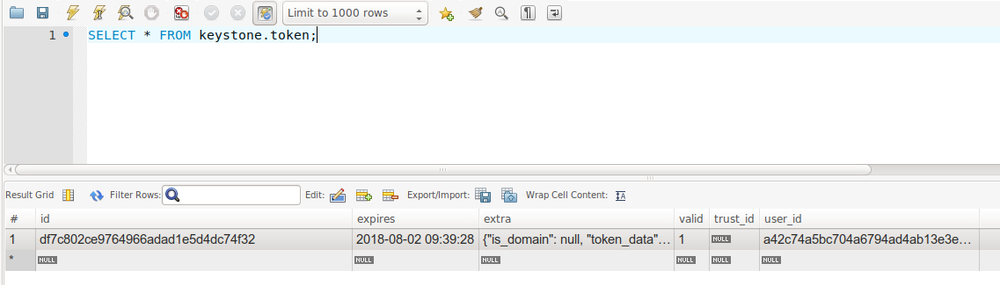

# Chuyển đổi cấu hình sinh token từ Fernet sang UUID
---
## Yêu cầu:
> Đã cái KeyStone project (manual hoặc packstack)

> Cài đặt MySQL Workbench để có giao diện GUI cho OPS hoặc có thể sử dụng `mysql cli` để thao tác với keystone

## Thay đổi định dang Token

### Bước 1: Thay đổi cấu hình

Truy cấp file cấu hình: `/etc/keystone/keystone.conf`
```
[token]
# Từ Fernet mặc định chuyển sang UUID
provider = uuid 

# Khi sử dụng UUID, phải chỉ rõ backend lưu trữ token
driver = sql
```

### Bước 2: Khởi động lại dịch vụ Keystone

```
systemctl restart httpd.service
```

## Kiểm tra lại 
### Lấy token uuid
Khởi tạo biến môi trường
```
[root@controller1 ~]# source admin-openrc
```

Lấy token
```
[root@controller1 ~]# openstack token issue
+------------+----------------------------------+
| Field      | Value                            |
+------------+----------------------------------+
| expires    | 2018-08-02T09:39:28+0000         |
| id         | df7c802ce9764966adad1e5d4dc74f32 |
| project_id | 04065487a847482380c654179e6d1c65 |
| user_id    | a42c74a5bc704a6794ad4ab13e3eee61 |
+------------+----------------------------------+
```
> Token ngắn, dạng UUID

### Kiếm tra db keystone

Sử dụng CLI
```
MariaDB [(none)]> select * from keystone.token\G;
*************************** 1. row ***************************
      id: df7c802ce9764966adad1e5d4dc74f32
 expires: 2018-08-02 09:39:28
   extra: {"is_domain": null, "token_data": {"token": {"is_domain": false, "methods": ["password"], "roles": [{"id": "2dab057958fb47878c1e0226bf6e5a1c", "name": "admin"}], "expires_at": "2018-08-02T09:39:28.000000Z", "project": {"domain": {"id": "default", "name": "Default"}, "id": "04065487a847482380c654179e6d1c65", "name": "admin"}, "catalog": [{"endpoints": [{"url": "http://172.16.4.205:9292", "interface": "public", "region": "RegionOne", "region_id": "RegionOne", "id": "0284749025dd4c368aa035cf1e89d474"}, {"url": "http://172.16.4.205:9292", "interface": "internal", "region": "RegionOne", "region_id": "RegionOne", "id": "488669788c5f4df994f797dfc3b2b00a"}, {"url": "http://172.16.4.205:9292", "interface": "admin", "region": "RegionOne", "region_id": "RegionOne", "id": "fddc0da5d33e482f88bcd6083e6a2a33"}], "type": "image", "id": "4695ffcf92e74b3a855cee8cf5d133d9", "name": "glance"}, {"endpoints": [{"url": "http://172.16.4.205:5000/v3/", "interface": "admin", "region": "RegionOne", "region_id": "RegionOne", "id": "2b5910a6bfac44e29da2ca8a557ee189"}, {"url": "http://172.16.4.205:5000/v3/", "interface": "internal", "region": "RegionOne", "region_id": "RegionOne", "id": "52b49915d2504985b65c11a35587aa49"}, {"url": "http://172.16.4.205:5000/v3/", "interface": "public", "region": "RegionOne", "region_id": "RegionOne", "id": "9a77a77c669f403da734be41da6ca117"}], "type": "identity", "id": "8fb78b3bb7bd4d3d93fcd79da0d8fec0", "name": "keystone"}], "user": {"id": "a42c74a5bc704a6794ad4ab13e3eee61", "domain": {"id": "default", "name": "Default"}, "password_expires_at": null, "name": "admin"}, "audit_ids": ["2DBihEEFTGWa4lqN66IDdQ"], "issued_at": "2018-08-02T08:39:28.000000Z"}}, "user": {"id": "a42c74a5bc704a6794ad4ab13e3eee61", "domain": {"id": "default", "name": "Default"}, "password_expires_at": null, "name": "admin"}, "key": "df7c802ce9764966adad1e5d4dc74f32", "token_version": "v3.0", "tenant": {"domain": {"id": "default", "name": "Default"}, "id": "04065487a847482380c654179e6d1c65", "name": "admin"}}
   valid: 1
trust_id: NULL
 user_id: a42c74a5bc704a6794ad4ab13e3eee61
1 row in set (0,00 sec)

```

Sử dụng GUI

)

> Do tính chất của token UUID (Token ko mang thông tin), token được lưu vào database nên ta thấy được ID token bên trong DB của keystone

> ID token sẽ tham kiếu đến 1 bảng trong db keystone, chứa thông tin về token user.

Lưu ý:
- Do token được lưu trong db, nên có rất nhiều token được sinh ra trong 1 ngày, để dọn dẹp các token đã hết hạn, sử dụng lệnh:
  ```
  keystone-manage token_flush
  ```


# Nguồn 

https://docs.openstack.org/keystone/pike/admin/identity-tokens.html

https://github.com/hocchudong/thuctap012017/blob/master/DucPX/OpenStack/Keystone/docs/Chuyen_Tu_Fernet_Sang_UUID.md

