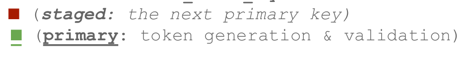
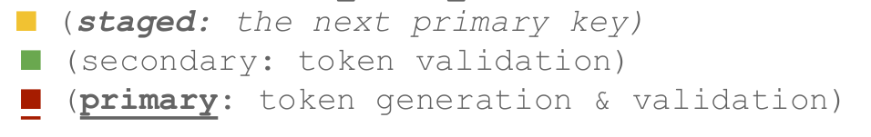
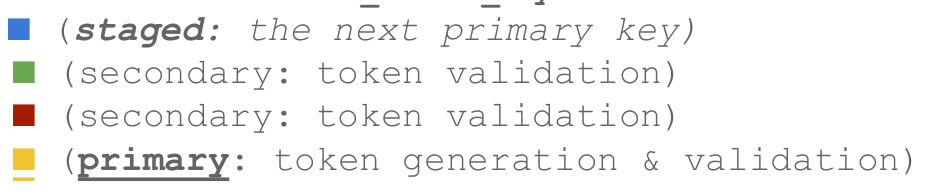
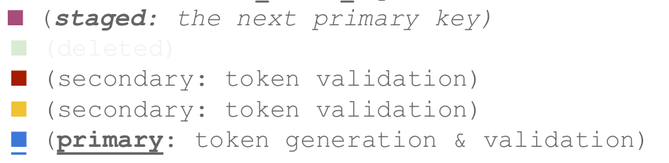
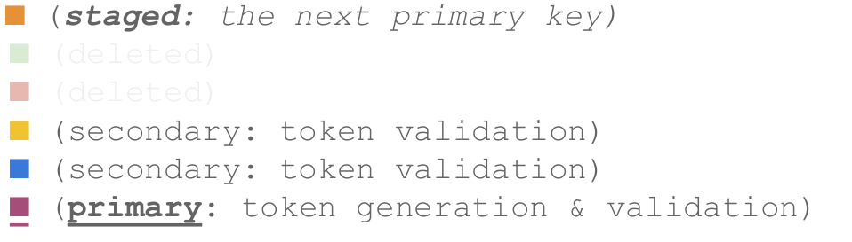

# Fernet token
---
## Cấu trúc fernet 
### fernet key
```
Signing-key ‖ Encryption-key
```

Lưu ý:
- Signing-key, 128 bits
- Encryption-key, 128 bits

### Token Format
```
Version ‖ Timestamp ‖ IV ‖ Ciphertext ‖ HMAC
```
Lưu ý
- Version, 8 bits
- Timestamp, 64 bits
- IV, 128 bits
- Ciphertext, variable length, multiple of 128 bits
- HMAC, 256 bits

## Cấu hình fernet 
### Cấu hình trong keystone.conf 
```
[token]
provider = fernet
```

### Khởi tạo khóa 
```
# Khởi tạo khóa 
[root@controller1 ~]# keystone-manage fernet_setup
```
> Khởi tạo key fernet trong key repository


### Xoay khóa
```
[root@controller1 ~]# keystone-manage fernet_rotate

# Kiểm tra
[root@controller1 ~]# ls /etc/keystone/fernet-keys/
0  1
```

## Quá trình xoay khóa
Lưu ý:
- Tham số `max_active_keys = 4`, tức trong 1 thời điểm sẽ tồn tại 4 khóa (1 stage, 2 secondary, 1 primary)
### Bước 1: Khởi tạo khóa
Quá trình này sẽ tạo ra 2 khóa:
- staged: Khóa chính tiếp theo
- primary: Khóa chính sử dụng cho sinh, chứng thực token



### Bước 2: Xoay khóa lần 1
Quá trình sinh thêm 1 khóa:
- staged: khóa chính tiếp theo
- secondary: khóa chính tiếp theo
- primary: sinh token và xác thực



### Bước 3: Xiay khóa lần 2
Quá trình sinh thêm 1 khóa:
- staged: khóa chính tiếp theo
- secondary 1: khóa chính tiếp theo
- secondary 2: khóa chính tiếp theo
- primary: sinh token và xác thực



### Bước 4: Xiay khóa lần 3
Quá trình sinh thêm 1 khóa:
- staged: khóa chính tiếp theo
- secondary 2: khóa chính tiếp theo
- secondary 3: khóa chính tiếp theo
- primary: sinh token và xác thực

> 1 khóa đã bị xóa



### Bước 5: Xiay khóa lần 4
Quá trình sinh thêm 1 khóa:
- staged: khóa chính tiếp theo
- secondary 3: khóa chính tiếp theo
- secondary 4: khóa chính tiếp theo
- primary: sinh token và xác thực

> 1 khóa đã bị xóa

