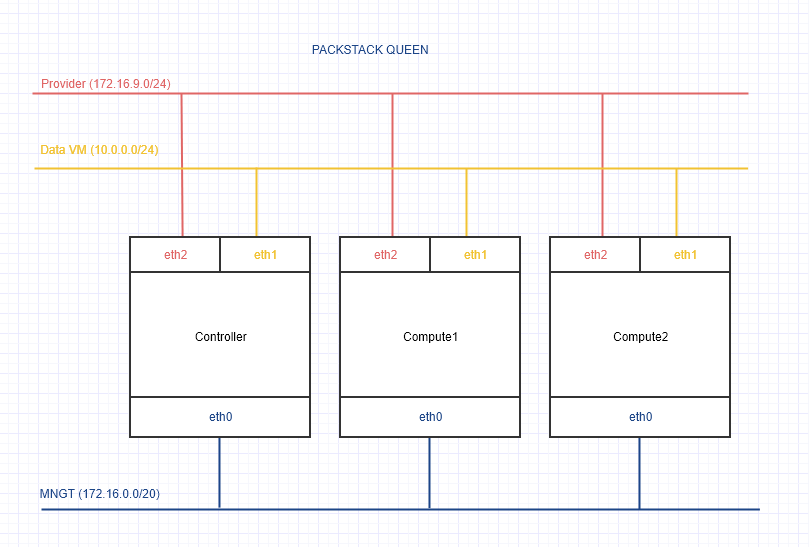

# Cài đặt PackStack bản Queen
---
## Mô hình

## Tài nguyên

## Cài đặt
### Tại Controller
- Thiết lập IP
 ```
 echo "Setup IP  eth0"
 nmcli c modify eth1 ipv4.addresses 172.16.4.205/20
 nmcli c modify eth1 ipv4.gateway 172.16.10.1
 nmcli c modify eth1 ipv4.dns 8.8.8.8
 nmcli c modify eth1 ipv4.method manual
 nmcli con mod eth1 connection.autoconnect yes

 echo "Setup IP  eth1"
 nmcli c modify eth0 ipv4.addresses 10.0.0.110/24
 nmcli c modify eth0 ipv4.method manual
 nmcli con mod eth0 connection.autoconnect yes

 echo "Setup IP  eth2"
 nmcli c modify eth2 ipv4.addresses 172.16.9.5/24
 nmcli c modify eth2 ipv4.method manual
 nmcli con mod eth2 connection.autoconnect yes
 
 sudo systemctl disable firewalld
 sudo systemctl stop firewalld
 sudo systemctl disable NetworkManager
 sudo systemctl stop NetworkManager
 sudo systemctl enable network
 sudo systemctl start network
 
 sed -i 's/SELINUX=enforcing/SELINUX=disabled/g' /etc/sysconfig/selinux
 sed -i 's/SELINUX=enforcing/SELINUX=disabled/g' /etc/selinux/config
 ``` 
- Khai báo repos cho OpenStack Queens
 ```
 yum install -y python-setuptools
 sudo yum install -y centos-release-openstack-queens
 yum update -y

 sudo yum install -y wget crudini fping
 yum install -y openstack-packstack

 yum install -y epel-release
 sudo yum install -y byobu 
 ```
- Thiết lập file hosts
 ```
 echo '
 # controller1
 172.16.4.205       controller1

 # compute1
 172.16.4.206       compute1

 # compute2
 172.16.4.207       compute2' >> /etc/hosts
 ```
### Tại compute1
- Thiết lập IP
 ```
 echo "Setup IP  eth0"
 nmcli c modify eth1 ipv4.addresses 172.16.4.206/20
 nmcli c modify eth1 ipv4.gateway 172.16.10.1
 nmcli c modify eth1 ipv4.dns 8.8.8.8
 nmcli c modify eth1 ipv4.method manual
 nmcli con mod eth1 connection.autoconnect yes

 echo "Setup IP  eth1"
 nmcli c modify eth0 ipv4.addresses 10.0.0.111/24
 nmcli c modify eth0 ipv4.method manual
 nmcli con mod eth0 connection.autoconnect yes

 echo "Setup IP  eth2"
 nmcli c modify eth2 ipv4.addresses 172.16.9.6/24
 nmcli c modify eth2 ipv4.method manual
 nmcli con mod eth2 connection.autoconnect yes
 
 sudo systemctl disable firewalld
 sudo systemctl stop firewalld
 sudo systemctl disable NetworkManager
 sudo systemctl stop NetworkManager
 sudo systemctl enable network
 sudo systemctl start network
 
 sed -i 's/SELINUX=enforcing/SELINUX=disabled/g' /etc/sysconfig/selinux
 sed -i 's/SELINUX=enforcing/SELINUX=disabled/g' /etc/selinux/config
 ``` 
- Khai báo repos cho OpenStack Queens
 ```
 yum install -y python-setuptools
 sudo yum install -y centos-release-openstack-queens
 yum update -y

 sudo yum install -y wget crudini fping
 yum install -y openstack-packstack

 yum install -y epel-release
 sudo yum install -y byobu 
 ```
- Thiết lập file hosts
 ```
 echo '
 # controller1
 172.16.4.205       controller1

 # compute1
 172.16.4.206       compute1

 # compute2
 172.16.4.207       compute2' >> /etc/hosts
 ```

### Tại compute2
- Thiết lập IP
 ```
 echo "Setup IP  eth0"
 nmcli c modify eth1 ipv4.addresses 172.16.4.207/20
 nmcli c modify eth1 ipv4.gateway 172.16.10.1
 nmcli c modify eth1 ipv4.dns 8.8.8.8
 nmcli c modify eth1 ipv4.method manual
 nmcli con mod eth1 connection.autoconnect yes

 echo "Setup IP  eth1"
 nmcli c modify eth0 ipv4.addresses 10.0.0.112/24
 nmcli c modify eth0 ipv4.method manual
 nmcli con mod eth0 connection.autoconnect yes

 echo "Setup IP  eth2"
 nmcli c modify eth2 ipv4.addresses 172.16.9.7/24
 nmcli c modify eth2 ipv4.method manual
 nmcli con mod eth2 connection.autoconnect yes
 
 sudo systemctl disable firewalld
 sudo systemctl stop firewalld
 sudo systemctl disable NetworkManager
 sudo systemctl stop NetworkManager
 sudo systemctl enable network
 sudo systemctl start network
 
 sed -i 's/SELINUX=enforcing/SELINUX=disabled/g' /etc/sysconfig/selinux
 sed -i 's/SELINUX=enforcing/SELINUX=disabled/g' /etc/selinux/config
 ``` 
- Khai báo repos cho OpenStack Queens
 ```
 yum install -y python-setuptools
 sudo yum install -y centos-release-openstack-queens
 yum update -y

 sudo yum install -y wget crudini fping
 yum install -y openstack-packstack

 yum install -y epel-release
 sudo yum install -y byobu 
 ```
- Thiết lập file hosts
 ```
 echo '
 # controller1
 172.16.4.205       controller1

 # compute1
 172.16.4.206       compute1

 # compute2
 172.16.4.207       compute2' >> /etc/hosts
 ```

### Cài đặt PackStack Queen
> Thực hiện tại controller
- Chạy terminal ảo, byobu có mục đính giữ phiên làm việc ssh hiện tại, tránh tình trạng disconnect, out phiên
 ```
 byobu
 ```
- Tạo file trả lời để cài packstack
 ```
 packstack packstack --gen-answer-file=/root/rdotraloi.txt \
    --allinone \
    --default-password=Welcome123 \
    --os-cinder-install=y \
    --os-ceilometer-install=y \
    --os-trove-install=n \
    --os-ironic-install=n \
    --os-swift-install=n \
    --os-panko-install=y \
    --os-heat-install=y \
    --os-magnum-install=n \
    --os-aodh-install=y \
    --os-neutron-ovs-bridge-mappings=extnet:br-ex \
    --os-neutron-ovs-bridge-interfaces=br-ex:eth2 \
    --os-neutron-ovs-bridges-compute=br-ex \
    --os-neutron-ml2-type-drivers=vxlan,flat \
    --os-controller-host=172.16.4.205 \
    --os-compute-hosts=172.16.4.206,172.16.4.207 \
    --os-neutron-ovs-tunnel-if=eth1 \
    --provision-demo=n
 ```

Lưu ý:
- `os-neutron-ovs-bridge-interfaces=br-ex:eth2`: Tham số này cần trỏ interface provider
- `--os-controller-host=172.16.4.205`: Tham số này trỏ về IP MNGT của Controller
- `--os-compute-hosts=172.16.4.206,172.16.4.207`: Tham số trỏ về IP MNGT của Compute1 và Compute2
- `--os-neutron-ovs-tunnel-if=eth1`: Trỏ về dải DataVM hay dải Tennat

- Thực thi file config (nếu cần có thể mở ra để chỉnh lại các tham số cần thiết.
 ```
 packstack --answer-file rdotraloi.txt
 ```
- Nhập mật khẩu đăng nhập ssh của tài khoản root khi được yêu cầu.
- Chờ để packstack cài đặt xong.

### Kiểm tra hoạt động của OpenStack sau khi cài
- Sau khi cài đặt xong, màn hình sẽ hiển thị thông báo như dưới
 ```
 **** Installation completed successfully ******
 Additional information:
  * Time synchronization installation was skipped. Please note that unsynchronized time on server instances might be problem for some OpenStack components.
  * File /root/keystonerc_admin has been created on OpenStack client host 172.16.4.205. To use the command line tools you need to source the file.
  * To access the OpenStack Dashboard browse to http://172.16.4.205/dashboard .
 Please, find your login credentials stored in the keystonerc_admin in your home directory.
  * Because of the kernel update the host 172.16.4.206 requires reboot.
  * Because of the kernel update the host 172.16.4.207 requires reboot.
  * The installation log file is available at: /var/tmp/packstack/xxx-xxx-xxx/openstack-setup.log
  * The generated manifests are available at: /var/tmp/packstack/xxx-xxx-LD0XmO/manifests
 ```
- Đứng trên `Controller1` thực hiện lệnh dưới để sửa các cấu hình cần thiết.
 ```
 sed -i -e 's/enable_isolated_metadata=False/enable_isolated_metadata=True/g' /etc/neutron/dhcp_agent.ini

 ssh -o StrictHostKeyChecking=no root@172.16.4.206 "sed -i -e 's/compute1/172.16.4.206/g' /etc/nova/nova.conf"

 ssh -o StrictHostKeyChecking=no root@172.16.4.207 "sed -i -e 's/compute2/172.16.4.207/g' /etc/nova/nova.conf"
 ```

### Khởi tạo dịch vụ
> Thực hiện trên tắt cả các node
- Tắt Iptables 
 ```
 systemctl stop iptables
 systemctl disable iptables
 ```
- Khởi động lại các node
 ```
 reboot
 ```

### Kiểm tra dịch vụ
> Truy cập node controller

Khởi tạo biến môi trường
```
source keystonerc_admin
```

Kiểm tra hoạt động của openstack
```
openstack token issue
```

Liệt kê service compute đã cấu hình:
```
openstack compute service list
```

Liệt kê danh sách API endpoint trong Identity service, xác thực Identity service:
```
openstack catalog list
```

Liệt kê các Image service, xác thực trạng thái service:
```
openstack image list
```

Kiểm tra các cell và Placement API:
```
nova-status upgrade check
```
