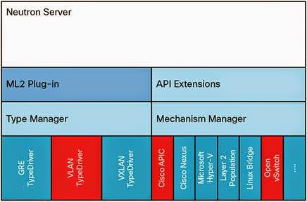

# OpenStack Networking Neutron
---
## Tổng quan về Neutron

Khi OpenStack mới ra mắt, dịch vụ network được cung cấp trong Nova (nova-networking). Ban đầu, Nova-networking bị hạn chế trong các mô hình network topo, và gần như không hỗ trợ các giải pháp của bên thứ ba. Nova-network chỉ có thể sử dụng Linux-bridge, hạn chế kiểu network và sử dụng iptable để cung cấp dịch vụ mạng cho hypervisor trong Nova. Do đó OPS phát triển project riêng về network, thay thế nova-networking. Project ban đầu tên Quantum sau đổi tên lại thành Neutron.

Neutron cho người quản trị tạo và quản lí các đối tượng network như network, subnet, và port sử dụng cho các dịch vụ trong OpenStack. Với kiến trúc mở (plugable), các plug-in có thể được sử dụng để triển khai các thiết bị và phần mềm khác nhau, nó khiến OpenStack trở nên linh hoạt trong kiến trúc và dễ triển khai.

Dịch vụ Networking trong OpenStack (neutron) cũng cấp API cho phép định nghĩa các kết nối mạng và gán địa chỉ ở trong môi trường cloud. Nó cũng cho phép các nhà khai thác vận hành các công nghệ networking khác nhau cho phù hợp bài toán riêng của họ. Neutron cũng cung cấp một API cho việc cấu hình cũng như quản lí các dịch vụ networking khác nhau từ L3 forwarding, NAT cho tới load balancing, perimeter firewalls, và virtual private networks.

Openstack là mô hình multitenancy. Tức mỗi tenant có thể tạo riêng nhiều private network, router, firewall, loadbalancer… Neutron có khả năng tách biệt các tài nguyên mạng giữa các tenant bằng giải pháp linux namespace. Mỗi network namespace riêng cho phép tạo các route, firewall rule, interface device riêng. Mỗi network hay router do tenant tạo ra đều hiện hữu dưới dạng 1 network namespace, từ đó các tenant có thể tạo các network trùng nhau (overlapping) nhưng vẫn độc lập mà không bị xung đột (isolated)

## Các thành phần trong Neutron
### API server
- Neutron API hỗ trợ Layer2 networking 
- IP address management (IPAM - quản lý địa chỉ IP), 
- Extension để xây dựng router Layer 3 cho phép định tuyến giữa các networks Layer 2 và các gateway để ra mạng bên ngoài. 

OpenStack Networking cung cấp một danh sách các plug-ins (đang ngày càng tăng lên) cho phép tương tác với nhiều công nghệ mạng mã nguồn mở và cả thương mại, bao gồm các routers, switches, switch ảo và SDN controller. Neutron API extension - Với API extension. user có thể định nghĩa nên các chức năng mạng bổ sung thông qua Neutron plugins.

### OpenStack Networking plug-in and agents
Các plugin và các agent này cho phép gắn và gỡ các ports, tạo ra network hay subnet, và đánh địa chỉ IP. Lựa chọn plugin và agents nào là tùy thuộc vào nhà cung cấp và công nghệ sử dụng trong hệ thống cloud nhất định. Điều quan trọng là tại một thời điểm chỉ sử dụng được một plug-in.

Các Neutron plugin:
- Là giao diện kết nối giữa Neutron và các công nghệ back-end như SDN, Cisco, VMware NSX. Nhờ đó người dùng Neutron có thể tận dụng được các tính năng nâng cao của các thiết bị mạng hoặc phần mềm mạng của bên thứ ba. Các plugin này bao gồm: Open vSwitch, Cisco UCS/Nexus, Linux Bridge, Nicira Network Virtualization Platform, Ryu OpenFlow Controller, NEC OpenFlow. 
- Một trong các plugin không trực tiếp liên quan tới công nghệ bên thứ ba nhưng là 1 plugin quan trọng đó là ML2 (Modular Layer 2) plugin. Plugin này cho phép hoạt động đồng thời của nhiều công nghệ mạng hỗn hợp trong Neutron.

Không có ML2 driver, Neutron chỉ có thể cung cấp dịch vụ lớp 2. Hai khái niệm về driver trong ML2 là Type và Mechanism:
- Type Manager: GRE, VLAN, VXLAN
- Mechanism Manager: Cisco APIC, Cisco Nexus, Linux Bridge, OvS

### Messaging queue
Tiếp nhận và định tuyến các RPC requests giữa các agents để hoàn thành quá trình vận hành API. Các Message queue được sử dụng trong ML2 plugin để thực hiện truyền thông RPC giữa neutron server và các neutron agents chạy trên mỗi hypervisor, cụ thể là các ML2 driver cho Open vSwitch và Linux bridge.

### Neutron server (neutron-server là neutron-*-plugin)
Dịch vụ này chạy trên các network node để phục vụ Networking API và các mở rộng của nó. Nó cũng tạo ra network model và đánh địa chỉ IP cho mỗi port. neutron-server và các plugin agent yêu cầu truy cập vào database để lưu trữ thông tin lâu dài và truy cập vào message queue (RabbitMQ) để giao tiếp nội bộ (giữa các tiến trình và với các tiến trình của các project khác)

1 số thành phần:
- Plugin agent (neutron-*-agent) - Chạy trên các Compute node để quản lý cấu hình các switch ảo cục bộ (vSwitch). Các plugin này xác định xem những agent nào đang chạy. Dịch vụ này yêu cầu truy cập vào message queue.
- DHCP agent (neutron-dhcp-agent) - Cung cấp dịch vụ DHCP cho tenant networks. Agent này chịu trách nhiệm duy trì cấu hình DHCP. neutron-dhcp-agent yêu cầu truy cập message queue
- L3 agent (neutron-l3-agent) - Cung cấp kết nối ra mạng ngoài (internet) cho các VM trên các tenant networks nhờ L3/NAT forwarding.
- Network provider service (SDN server/services) - Cung cấp dịch vụ mạng nâng cao cho tenant network. Các dịch vụ SDN này có thể tương tác với neutron-server, neutron-plugin, plugin-agents thông qua REST APIs hoặc các kênh kết nối khác.

## Các khái niệm về Network trong OPS
Với neutron, ta có thể tạo và cấu hình các network, subnet và thông báo tới Compute để gán các thiết bị ảo vào các port của mạng vừa tạo. OpenStack Compute chính là "khách hàng" của neutron, chúng liên kết với nhau để cung cấp kết nối mạng cho các máy ảo. Cụ thể hơn, OpenStack Networking hỗ trợ cho phép các project có nhiều private networks và các projects có thể tự chọn danh sách IP cho riêng mình, kể cả những IP đã được sử dụng bởi một project khác. 

Có hai loại network
- Provider;
-  Self-service networks;

### 1. Provider networks
Provider networks cung cấp kết nối layer 2 cho các máy ảo với các tùy chọn hỗ trợ cho dịch vụ DHCP và metadata. Các kết nối này thường sử dụng VLAN (802.1q) để nhận diện và tách biệt nhau. Nhìn chung, Provider networks cũng cấp sự đơn giản, hiệu quả và sự minh bạch, linh hoạt trong chi phí. Mặc định chỉ có duy nhất người quản trị mới có thể tạo hoặc cập nhật provider networks bởi nó yêu cầu phải cấu hình thiết bị vật lí. 

Bên cạnh đó, các provider network chỉ quản lí kết nối ở layer 2 cho máy ảo, vì thế nó thiếu đi một số tính năng ví dụ như `định tuyến` và `gán floating IP`. Các nhà khai thác đã quen thuộc với kiến trúc mạng ảo dựa trên nền tảng mạng vật lí cho layer 2, layer 3 và các dịch vụ khác có thể dễ dàng triển khai OpenStack Networking service.  

Vấn đề cần quan tâm, các thành phần chịu trách nhiệm cho việc vận hành kết nối layer 3 sẽ ảnh hưởng tới hiệu năng và tính tin cậy nên provider networks. Tức nếu kết nối mạng có vấn đề thì provider network cũng bị ảnh hưởng.

#### Routed provider network
Routed provider networks cung cấp kết nối ở layer 3 cho các máy ảo. Các network này map với những networks layer 3 đã tồn tại. Cụ thể hơn, các layer-2 segments của provider network sẽ được gán các router gateway giúp chúng có thể được định tuyến ra bên ngoài chứ thực chất Networking service không cung cấp khả năng định tuyến. Routed provider networks tất nhiên sẽ có hiệu suất thấp hơn so với provider networks.

### 2. Self-service networks

Self-service networks được ưu tiên trong projects thông thường, quản lí networks mà không cần quản trị viên (quản lí network trong project). Các networks này là ảo và nó yêu cầu các routers ảo để giao tiếp với provider network và external network. Self-service networks hỗ trợ cung cấp dịch vụ DHCP và metadata cho máy ảo.

Trong hầu hết các trường hợp, self-service networks sử dụng các giao thức như VXLAN hoặc GRE bởi chúng hỗ trợ nhiều hơn là VLAN tagging (802.1q). Bên cạnh đó, Vlans cũng thường yêu cầu phải cấu hình thêm ở tầng vật lí.

Với IPv4, self-service networks thường sử dụng dải mạng riêng và tương tác với provider networks thông qua cơ chế NAT trên router ảo. `Floating IP` sẽ cho phép kết nối tới máy ảo với dải provider thông qua địa chỉ NAT trên router ảo. Trong khi đó, IPv6 self-service networks thì lại sử dụng dải IP public và tương tác với provider networks bằng giao thức định tuyến tĩnh qua router ảo.

Trái ngược lại với provider networks, self-service networks buộc phải đi qua layer-3 agent. Vì thế việc gặp sự cố ở một node có thể ảnh hưởng tới rất nhiều các máy ảo sử dụng chúng.

Các user có thể tạo các project networks cho các kết nối bên trong project. Mặc định thì các kết nối này là riêng biệt và không được chia sẻ giữa các project. 

## OpenStack Networking hỗ trợ các công nghệ dưới đây cho project network
- Flat: Tất cả các instances nằm trong cùng một mạng, và có thể chia sẻ với hosts. Không hề sử dụng VLAN tagging hay hình thức tách biệt về network khác.
- VLAN: Cho phép các user tạo nhiều provider hoặc project network sử dụng VLAN IDs(chuẩn 802.1Q tagged) tương ứng với VLANs trong mạng vật lý. Điều này cho phép các instances giao tiếp với nhau trong môi trường cloud. Chúng có thể giao tiếp với servers, firewalls, load balancers vật lý và các hạ tầng network khác trên cùng một VLAN layer 2.
- GRE và VXLAN: VXLAN và GRE là các giao thức đóng gói tạo nên overlay networks để kích hoạt và kiểm soát việc truyền thông giữa các máy ảo (instances). Một router được yêu cầu để cho phép lưu lượng đi ra luồng bên ngoài tenant network GRE hoặc VXLAN. Router cũng có thể yêu cầu để kết nối một tenant network với mạng bên ngoài (ví dụ Internet). Router cung cấp khả năng kết nối tới instances trực tiếp từ mạng bên ngoài sử dụng các địa chỉ floating IP.
- Subnets: Là một khối tập hợp các địa chỉ IP và đã được cấu hình. Quản lý các địa chỉ IP của subnet do IPAM driver thực hiện. Subnet được dùng để cấp phát các địa chỉ IP khi ports mới được tạo trên network.
- Subnet pools: Người dùng cuối thông thường có thể tạo các subnet với bất kì địa chỉ IP hợp lệ nào mà không bị hạn chế. Tuy nhiên, trong một vài trường hợp, sẽ là ổn hơn nếu như admin hoặc tenant định nghĩa trước một pool các địa chỉ để từ đó tạo ra các subnets được cấp phát tự động. Sử dụng subnet pools sẽ ràng buộc những địa chỉ nào có thể được sử dụng bằng cách định nghĩa rằng mỗi subnet phải nằm trong một pool được định nghĩa trước. Điều đó ngăn chặn việc tái sử dụng địa chỉ hoặc bị chồng lấn hai subnets trong cùng một pool.
- Ports: Là điểm kết nối để attach một thiết bị như card mạng của máy ảo tới mạng ảo. Port cũng được cấu hình các thông tin như địa chỉ MAC, địa chỉ IP để sử dụng port đó.
- Router: Cung cấp các dịch vụ layer 3 ví dụ như định tuyến, NAT giữa các self service và provider network hoặc giữa các self service với nhau trong cùng một project.
- Security groups: 
 - Một security groups được coi như một firewall ảo cho các máy ảo để kiểm soát lưu lượng bên trong và bên ngoài router. Security groups hoạt động mức port, không phải mức subnet. Do đó, mỗi port trên một subnet có thể được gán với một tập hợp các security groups riêng. Nếu không chỉ định group cụ thể nào khi vận hành, máy ảo sẽ được gán tự động với default security group của project. Mặc định, group này sẽ hủy tất cả các lưu lượng vào và cho phép lưu lượng ra ngoài. Các rule có thể được bổ sung để thay đổi các hành vi đó. Security group và các security group rule cho phép người quản trị và các tenant chỉ định loại traffic và hướng (ingress/egress) được phép đi qua port. Một security group là một container của các security group rules.
 - Các rules trong security group phụ thuộc vào nhau. Vì thế nếu bạn cho phép inbound TCP port 22, hệ thống sẽ tự động tạo ra 1 rule cho phép outbound traffic trả lại và ICMP error messages liên quan tới các kết nối TCP vừa được tạo rules.
- Extensions: OpenStack Networking service có khả năng mở rộng. Có hai mục đích chính cho việc này: 
 - Cho phép thực thi các tính năng mới trên API mà không cần phải đợi đến khi ra bản tiếp theo và cho phép các nhà phân phối bổ sung những chức năng phù hợp. 
 - Các ứng dụng có lấy danh sách các extensions có sẵn sử dụng phương thức GET trên /extensions URI. Chú ý đây là một request phụ thuộc vào phiên bản OpenStack, một extension trong một API ở phiên bản này có thể không sử dụng được cho phiên bản khác.
- DHCP: Dịch vụ tùy chọn DHCP quản lí địa chỉ IP trên provider và self-service networks. Networking service triển khai DHCP service sử dụng agent quản lí qdhcp namespaces và dnsmasq service.
- Metadata: Dịch vụ tùy chọn cung cấp API cho máy ảo để lấy metadata ví dụ như SSH keys.
- Open vSwitch: OpenvSwitch (OVS) là công nghệ switch ảo hỗ trợ SDN (Software-Defined Network), thay thế Linux bridge. OVS cung cấp chuyển mạch trong mạng ảo hỗ trợ các tiêu chuẩn Netflow, OpenFlow, sFlow. OpenvSwitch cũng được tích hợp với các switch vật lý sử dụng các tính năng lớp 2 như STP, LACP, 802.1Q VLAN tagging. OVS tunneling cũng được hỗ trợ để triển khai các mô hình network overlay như VXLAN, GRE.
- L3 Agent: Một phần của package openstack-neutron. Nó được xem như router layer3 chuyển hướng lưu lượng và cung cấp dịch vụ gateway cho network lớp 2. Các nodes chạy L3 agent không được cấu hình IP trực tiếp trên một card mạng mà được kết nối với mạng ngoài. Thay vì thế, sẽ có một dải địa chỉ IP từ mạng ngoài được sử dụng cho OpenStack networking. Các địa chỉ này được gán cho các routers mà cung cấp liên kết giữa mạng trong và mạng ngoài. Miền địa chỉ được lựa chọn phải đủ lớn để cung cấp địa chỉ IP duy nhất cho mỗi router khi triển khai cũng như mỗi floating IP gán cho các máy ảo.
 - DHCP Agent: OpenStack Networking DHCP agent chịu trách nhiệm cấp phát các địa chỉ IP cho các máy ảo chạy trên network. Nếu agent được kích hoạt và đang hoạt động khi một subnet được tạo, subnet đó mặc định sẽ được kích hoạt DHCP.
 - Plugin Agent: Nhiều networking plug-ins được sử dụng cho agent của chúng, bao gồm OVS và Linux bridge. Các plug-in chỉ định agent chạy trên các node đang quản lý lưu lượng mạng, bao gồm các compute node, cũng như các nodes chạy các agent

## Cấu trúc thành phần và dịch vụ

Server: 
- Cung cấp API, quản lí database,...

Plug-ins: 
- Quản lí agents

Agents 
- Cung cấp kết nối layer 2/3 tới máy ảo
- Xử lý truyền thông giữa mạng ảo và mạng vật lý.
- Xử lý metadata, etc.

Layer 2 (Ethernet and Switching)
- Linux Bridge
- OVS

Layer 3 (IP and Routing)
- L3
- DHCP
- Miscellaneous
- Metadata
- Services

Các dịch vụ Routing
- VPNaaS: Virtual Private Network-as-a-Service (VPNaaS), extension của neutron cho VPN
- LBaaS: Load-Balancer-as-a-Service (LBaaS), API quy định và cấu hình nên các load balancers, được triển khai dựa trên HAProxy software load balancer.
- FWaaS: Firewall-as-a-Service (FWaaS), API thử nghiệm cho phép các nhà cung cấp kiểm thử trên networking của họ.

# Nguồn

https://github.com/hocchudong/thuctap032016/blob/master/ThaiPH/OpenStack/ThaiPH_baocaotimhieucacprojecttrongopenstack.md

https://github.com/hocchudong/ghichep-OpenStack/blob/master/04-Neutron/learning%20neutron%20openstack.md

https://github.com/hocchudong/ghichep-OpenStack/blob/master/04-Neutron/learning%20neutron%20openstack.md

