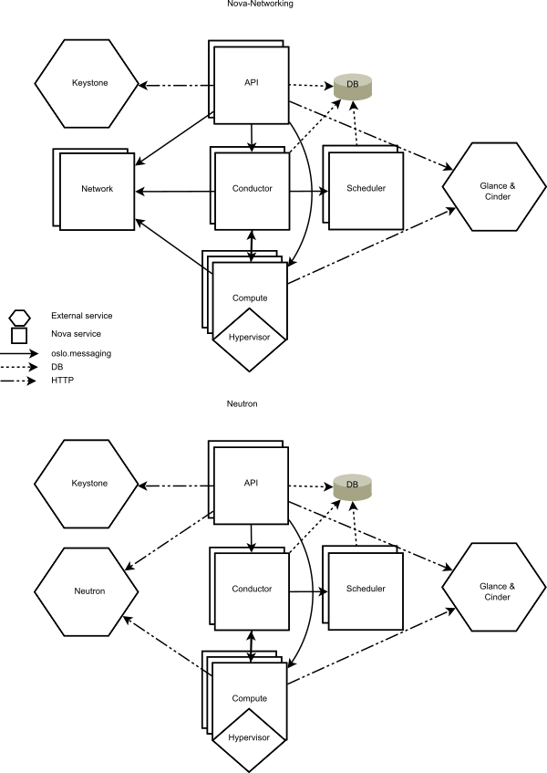

# Tìm hiểu Compute Service - Nova
---
## Giới thiệu về Compute Service - Nova

Nova là thành phần quan trọng và phức tạp nhất trong các project của openstack. Nova chịu trách nhiệm quản lý các hệ thống cloud computing. Nova cho phép người quản trị điều khiển các máy ảo và network, người quản trị cũng có thể quản lí các truy cập của người dùng users và projects. Quản lí các máy ảo trong môi trường OpenStack, chịu trách nhiệm khởi tạo, lập lịch, ngừng hoạt động của các máy ảo theo yêu cầu.

OpenStack Compute không chứa các phần mềm ảo hóa. Thay vào đó, nó sẽ định nghĩa các drivers để tương tác với các kĩ thuật ảo hóa (công nghệ ảo hóa) chạy trên hệ điều hành, cung cấp các chức năng thông qua một web-based API.

OpenStack Compute chính là phần chính quan trọng nhất trong kiến trúc hệ thống Infrastructure-as-a-Service (IaaS). Phần lớn các modules của Nova được viết bằng Python. OpenStack Compute giao tiếp với OpenStack Identity để xác thực, OpenStack Image để lấy images và tương tác thông OpenStack Dashboard cung cấp giao diện quản trị.

Các vấn đề chính:
- Nova bao gồm nhiều tiến trình trên server, mỗi tiến trình lại thực hiện một chức năng khác nhau.
- Nova cung cấp REST API để tương tác với user, các thành phần bên trong Nova truyền thông với nhau thông qua cơ chế truyền RPC message.
- API server xử lý các REST request, thường liên quan đến việc đọc/ghi databases, tùy chọn gửi RPC messages đến các Nova services khác, và tạo ra các trả lời cho REST calls. RPC message thực hiện thông qua thư viện oslo.messaging - lớp trừu tượng ở phía trên của các message queue.
- Hầu hết các thành phần chính của Nova có thể chạy trên nhiều server, và có manager lắng nghe RPC messages. Ngoài trừ nova-compute, tiến trình duy nhất chạy trên hypervisor mà nó quản lý (ngoài trừ sử dụng VMware hoặc Ironic drivers).
- Nova có thể sử dụng central database được chia sẻ giữa tất các thành phần. Tuy nhiên, để hỗ trợ upgrade, DB được truy cập thông qua một object layer để đảm bảo các thành phần kiểm soát đã upgrade có thể giao tiếp với nova-compute chạy ở phiên bản trước. Để làm điều này, nova-compute ủy quyền các yêu cầu tới DB thông qua RPC tới một trình quản lý trung tâm, chính là dịch vụ nova-conductor.

## Các thành phần của Nova

- nova-api: Là service tiếp nhận và phản hồi các compute API calls từ user. Service hỗ trợ OpenStack Compute API, Amazon EC2 API và Admin API đặc biệt được dùng để user thực hiện các thao tác quản trị. Nó cũng có một loạt các policies và thực hiện hầu hết các orchestration activities ví dụ như chạy máy ảo.
- nova-api-metadata: Là service tiếp nhận các metadata request từ máy ảo. Service này thường được dùng khi chạy multi-host kết hợp với nova-network.
- nova-compute: Là service chịu trách nhiệm tạo và hủy các máy ảo qua hypervisors APIs. Ví dụ:
  - XenAPI for XenServer/XCP
  - libvirt for KVM or QEMU
  - VMwareAPI for VMware
- nova-placement-api: Lần đầu xuất hiện tại bản Newton, placement api được dùng để theo dõi thống kê và muức độ sử dụng của mỗi một resource provider. Provider ở đây có thể là compute node, shared storage pool hoặc IP allocation pool. Ví dụ, một máy ảo có thể được khởi tạo và lấy RAM, CPU từ compute node, lấy disk từ storage bên ngoài và lấy địa chỉ IP từ pool resource bên ngoài.
- nova-scheduler: Service này sẽ lấy các yêu cầu máy ảo đặt vào queue và xác định xem chúng được chạy trên compute server host nào.
- nova-conductor: Là module chịu trách nhiệm về các tương tác giữa nova-compute và database. Nó sẽ loại bỏ tất cả các kết nối trực tiếp từ nova-compute tới database.
- nova-consoleauth : Xác thực token cho user mà console proxies cung cấp. Dịch vụ này buộc phải chạy cùng với console proxies. Bạn có thể chạy proxies trên 1 nova-consoleauth service hoặc ở trong 1 cluster configuration.
- nova-novncproxy : Cung cấp proxy cho việc truy cập các máy ảo đang chạy thông qua VNC connection. Nó hỗ trợ các trình duyệt based novnc clients.
- nova-spicehtml5proxy : Cung cấp proxy để truy cập các máy ảo đang chạy thông qua SPICE connection. Nó hỗ trợ các trình duyệt based HTML5 client.
- nova-xvpvncproxy : Cung cấp proxy cho việc truy cập các máy ảo đang chạy thông qua VNC connection. Nó hỗ trợ OpenStack-specific Java client.
- queue: Trung tâm giao tiếp giữa các daemons. Thường dùng RabbitMQ hoặc các AMQP message queue khác như ZeroMQ.
- SQL database : Dùng để lưu các trạng thái của hạ tâng caloud bảo gồm:
  - Các loại máy ảo có thể chạy
  - Các máy ảo đang được dùng
  - Các network khả dụng
  - projects

Nova sử dụng thiết kế shared-nothing, như vậy bạn có thể chạy tất cả các thành phần trên các servers riêng lẻ. Trạng thái của mỗi dịch vụ được lưu trong database. Hàng đợi thông điệp (message queue) xử lý tất cả các yêu cầu và chuyển đến cho scheduler. Nova compute hỗ trợ nhiều hypervisors phổ biến. Docker, Hyper-V, Kernel-based Virtual Machine (KVM), Linux Containers (LXC), Quick Emulator (QEMU), VMware vSphere and Xen.

Hệ thống compute được thiết kế cho khách hàng chia sẻ một tài nguyên chung. Có một role dựa trên access assignments nơi mà các user có thể làm những gì mà học được phép làm. Role kiểm soát các hoạt động mà user được chỉ định thực hiện.

## Kiến trúc của Nova

### Kiến trúc tổng quan

- DB: sql database để lưu trữ dữ liệu.
- API: Thành phần để nhận HTTP request , chuyển đổi các lệnh và giao tiếp với thành các thành phần khác thông qua oslo.messaging queuses hoặc HTTP.
- Scheduler: Quyết định ,máy chủ được chọn để chạy máy ảo.
- Network: quản lý ip forwarding, bridges, và vlan.
- Compute: Quản lý giao tiếp với hypervisor và vitual machines.
- Conductor: Xử lý các yêu cầu mà cần sự phối hợp (build/resize), hoạt động như một proxy cho cơ sở dữ liệu, hoặc đối tượng chuyển đổi.

### Kiến trúc cơ bản

- API: Giao diện người dùng với hệ thống openstack thông qua API. Nó là "trái tim" của cloud framework. Nó tạo hypervisor, storage và network để sẵn sàng cho người dùng. Tại endpoint của API, có dịch vụ web cơ bản là RESTful HTTP mà xử lý xác thực, ủy quyền, và lệnh cơ bản và kiểm soát các chức năng. Bạn có thể sử dụng API và các tiện ích sau khi bạn xác thực thông qua Identity API. Để đổi lấy một tập hợp các thông tin xác thực, dịch vụ Identity sinh ra các token. Một token tượng trung cho đã xác thực bởi Identity của một user và, tùy chọn, ủy quyền trên một project hoặc domain cụ thể.
- Message queue: Nó phối hợp sự tác động qua lại lẫn nhau giữa các compute nodes, network, controllers, scheduler và các thành phần giống nhau. Khi server API nhận yêu cầu từ người dùng, nó xác thực người dùng, xử lý yêu cầu và sau đó chuyển đến công cụ xếp hàng (queuing engine) cho các worker thực hiện phù hợp. Khi worker nhập được công việc mà nó đã được chỉ định làm, nó đồng ý nhiệm vụ và bắt đầu thực hiện công việc đó. Lúc hoàn thành, một response được gửi đến hàng đợi.
- Compute: Compute workers quản lý nodes compute. Nó chịu trách nhiệm chạy, kết thúc, reboot instances, gắn/tháo volumes và set đầu ra console.
- Network Controller: Quản lý tài nguyên mạng trên host. Một số công việc bao gồm cấp phát địa chỉ IP cố định, cấu hình VLANs và cấu hình mạng cho các node compute.

## Nguồn

https://github.com/hocchudong/thuctap012017/blob/master/DucPX/OpenStack/Nova/docs/OverviewNova.md

https://github.com/meditechopen/meditech-thuctap/blob/master/ThaoNV/Tim%20hieu%20OpenStack/docs/nova/nova-overview.md
