# Qúa trình khởi tạo VM
---
## Bước 1: Xác thực với Keystone
- User sử dụng cli hoặc login từ horizon để xác thực với Keystone
- Sau khi quá trình xác thực chính xác Keystone, user nhận lại unscope token
  - Trong unscoped token chứa danh sách Project ID và Role của user
- Từ unscope token: 
  - User lựa chọn project mong muốn sử dụng
  - Request tới Keystone tạo scoped token để làm việc với các service (nova, neutrong, ..) trong project

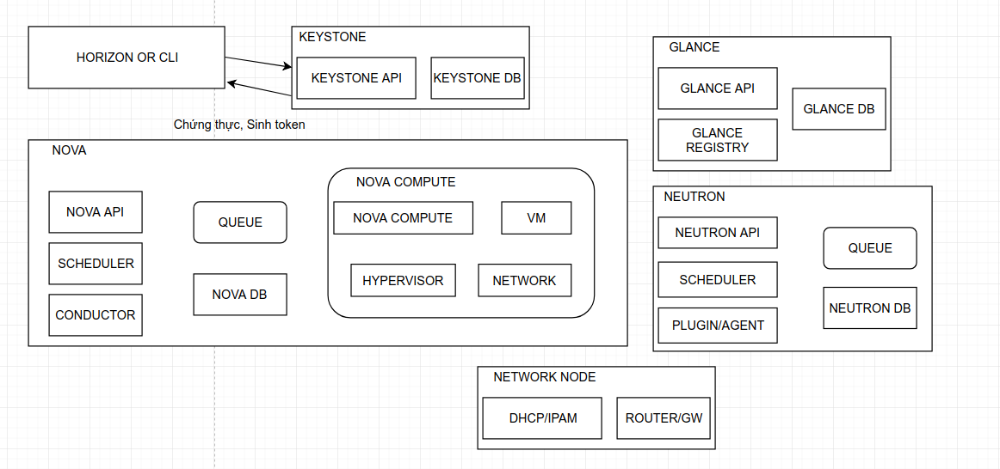

## Bước 2: Yều cầu tạo VM
- Sau bước 1, user đã có quyền làm việc với các project
- User ra lệnh tạo VM tới Nova API
- Nova API nhận yêu cầu, xác thực ngược scoped token user với Keystone
  - Nếu xác thực được, quá trình tiếp tục
  - Nếu không thể, quá trình block

- Nova api: 
  - Gửi chỉ thị tới Nova DB (Sử dụng SQLAlchemy)
  - Gửi chỉ thị tạo VM tới Nova scheduler qua Queue
  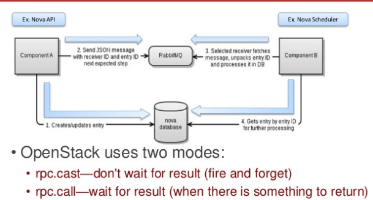
  > khái niệm queue trong ops
- Nova scheduler:
  - Nhận request từ queue 
  - Lấy đối trượng từ Nova DB 

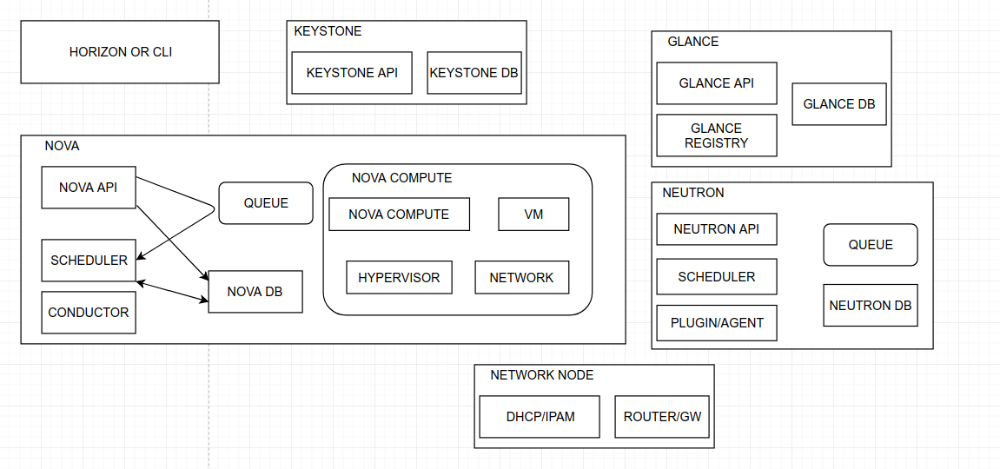

- Cơ bản, Nova scheduler chịu trách nhiệm xác định Host phù hợp để tạo VM mới
  - Sử dụng `Chance` và `Filter` để lựa chọn 
  - Việc lựa chọn dựa trên thông số trong DB, thuật toán đánh giá compute node
- Sau khi lựa chọn xong, Nova scheduler gửi yêu cầu cung cấp VM tới Nova Compute (qua queue)

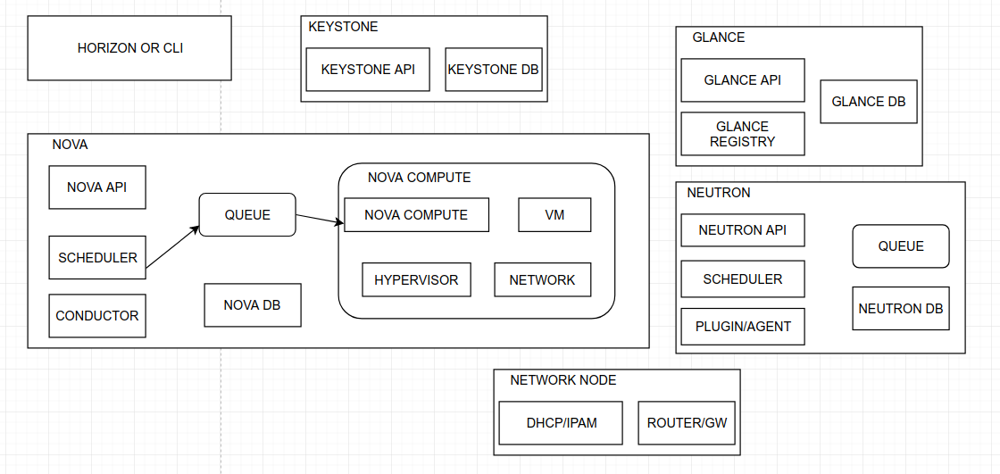

- Nova compute là service quản trị VM trên các node nova Compute
  - Nova compute không phải công nghệ ảo hóa, mà nó sử dụng các drive để làm việc với các công nghệ ảo hóa
  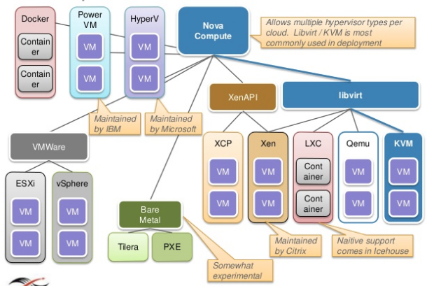
- Nova compute:
  - Lấy thông tin VM ừ Nova DB
  - Giao tiếp giữa Nova compute với Nova DB thông quan Nova Conductor (Nova compute không giao tiếp trực tiếp với Nova DB)

- Mục đích Nova Conductor:
  - Bỏ qua thành phần remote connect DB giữa nova compute vs nova db
  - Giấu đi db của nova với nova compute, tăng bảo mật
  - Tăng hiệu năng trong mô hình nhiều node.
  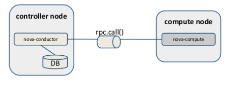

### Bước 3: Yêu cầu network cho VM (Request to neutron)
- Sau khi lấy được thông tin VM, nova compute request tới Neutron API, yêu cầu cung cấp network cho VM
- Neutron nhận được yêu cầu, xác thực lại request tới keystone, sử dụng thành phần `Plugin/Agent` tương tác với Network node, cung cấp Network tới Nova Compute 

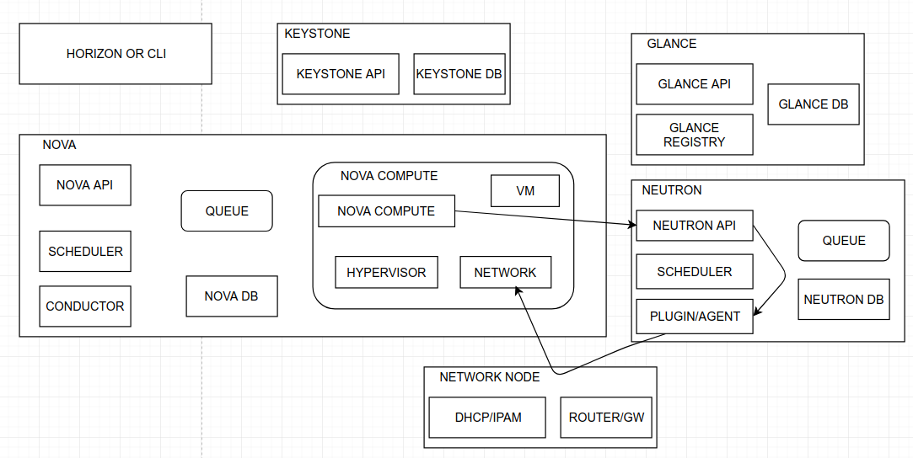

### Bước 4: Yêu cầu storage
- Nova compute sau khi nhận được network từ Neutron, thực hiện yêu cầu cung cấp nơi lưu trữ VM để thực hiện quá trình boot. Có 3 lựa chọn:
  - Tạo VM trên Ephemeral storage
  - Tạo VM trên Block storage
  > Xem đánh giá tại ..

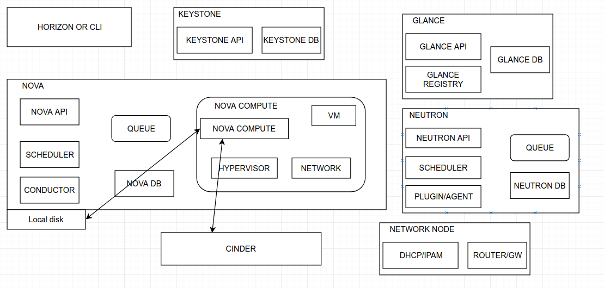

### Bước 5: Yêu cầu image cho VM (Request to Glance)
- Sau khi lựa chọn storage phù cho VM, Nova compute gửi yêu cầu tới Glance API, yêu cầu cung cấp Image
- Glance API nhận yêu cầu, xác thực lại request với keystone, nếu request chứng thực thành công:
  - Tìm kiếm Image phù hợp,nếu có, trả lại URI image để nova compute thực hiện quá trình download và boot VM
  > Image có thể được lưu tại object storage (ceph, swift), block storage (cinder), HTTP, FS, RBD ....

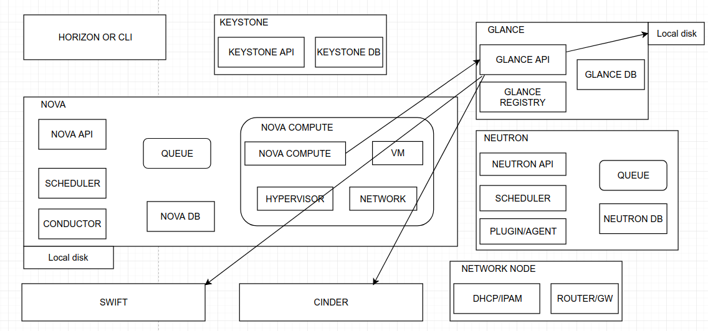

### Bước 6: Boot VM

- Nova compute nhận image uri, down image, gán storage vào vm, thực hiện quá trình boot với image ( quá trình boot sẽ sử dụng `drive` kết nối tới các hypervisor).

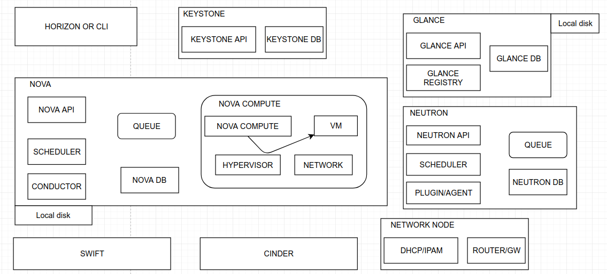

- Nova compute update trạng thái VM tới Nova Db thông quá Nova Conductor

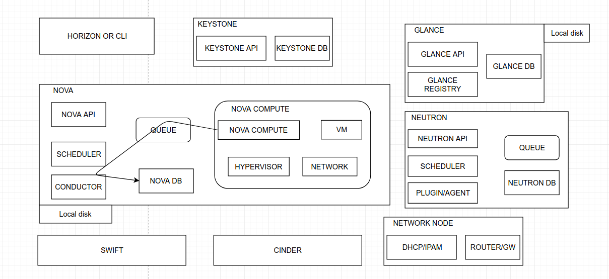

### Bước 7: Cập nhật trạng thái VM

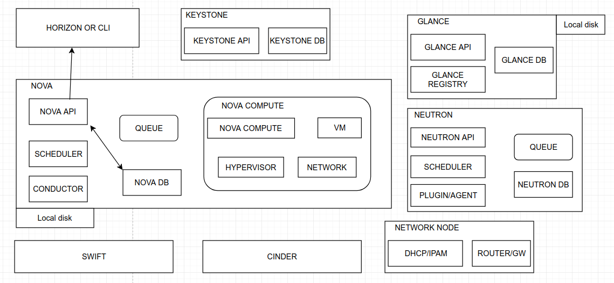

# Nguồn

https://ilearnstack.wordpress.com/2013/04/26/request-flow-for-provisioning-instance-in-openstack/?preview=true&preview_id=410&preview_nonce=3618fe51b7

https://www.slideshare.net/openstack/openstack-super-bootcamppdf

https://www.slideshare.net/mirantis/openstack-architecture-43160012